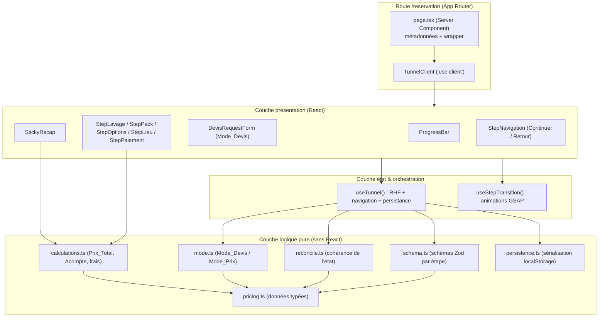

# Design Document

## Overview

Le **Questionnaire de Devis / Réservation** (« le Tunnel ») est un parcours de commande multi-étapes qui remplace la page `/reservation` actuelle de Vista Clean. Il guide le Client à travers cinq Étapes séquentielles — Lavage, Pack, Options, Lieu, Paiement — en affichant un calcul de prix en temps réel et un Récapitulatif persistant, tout en basculant automatiquement vers une demande de devis (`Mode_Devis`) lorsque le support sélectionné ne relève pas d'une tarification automatique.

Le Tunnel s'appuie sur l'architecture existante du site : Next.js 16 (App Router), React 19, Tailwind CSS 4, composants shadcn/ui basés sur `@base-ui/react` (style `base-nova`, **sans prop `asChild`**), GSAP pour les animations, Lucide React pour les icônes, TypeScript. Le thème violet + noir est sombre par défaut et bascule en clair via le paramètre d'URL `?theme=light` (script inline déjà présent dans `layout.tsx`). Le fond animé (`AnimatedBackground`) et la palette oklch existante sont réutilisés tels quels.

Deux briques nouvelles sont introduites, conformément aux exigences non-fonctionnelles (Requirement 17) :

- **React Hook Form + Zod** pour la gestion d'état et la validation du formulaire multi-étapes (nouvelles dépendances à installer).
- **Une source de données de tarification typée et centralisée** (`src/lib/devis/pricing.ts`) regroupant Supports, Packs, Options et prix.

Objectifs de conception clés :

- **Séparation nette logique / présentation** : toute la logique tarifaire, la validation et la réconciliation d'état vivent dans des fonctions pures testables, indépendantes du rendu React.
- **Mobile-first et accessible** : cibles tactiles ≥ 44 px, navigation clavier complète, annonces aux technologies d'assistance, contraste ≥ 4,5:1, distinction d'état sans dépendre uniquement de la couleur.
- **Performance perçue** : recalcul du prix et du récapitulatif < 300 ms, transitions d'étape ≤ 500 ms, respect de `prefers-reduced-motion`.

## Architecture

### Vue d'ensemble en couches



### Décisions d'architecture

1. **Server Component + îlot client.** `page.tsx` reste un Server Component (métadonnées SEO, cohérence avec les autres pages) et rend un unique composant client `TunnelClient` (`"use client"`) qui héberge tout l'état interactif. Cela suit le motif existant (les pages actuelles marquent `"use client"` en tête lorsque nécessaire).

2. **Logique pure isolée dans `src/lib/devis/`.** Les calculs de prix, la détermination du mode, la réconciliation d'état, les schémas de validation et la (dé)sérialisation sont des fonctions pures sans dépendance à React ni au DOM. Cette séparation répond directement à l'objectif de testabilité (property-based testing) et de maintenabilité.

3. **React Hook Form comme source de vérité unique de l'état du formulaire.** Un seul `useForm` gère l'`État_Tunnel` complet. La validation par étape s'effectue via `trigger()` sur un sous-schéma Zod avant d'autoriser l'avancement (Requirement 17.3).

4. **Persistance découplée via abonnement.** Un effet s'abonne à `form.watch()` et écrit l'état sérialisé dans `localStorage` (débounce léger). À l'initialisation, `defaultValues` est hydraté depuis `localStorage` si présent (Requirement 12).

5. **Animations GSAP encapsulées.** Un hook `useStepTransition` gère les transitions entre étapes avec `gsap.context` et `gsap.matchMedia` pour respecter `prefers-reduced-motion`, en cohérence avec `AnimatedBackground` existant. Aucune logique métier dans ce hook.

6. **Branche Mode_Devis vs Mode_Prix pilotée par les données.** Le mode est dérivé du Support sélectionné par une fonction pure `resolveMode(supportId)`. En `Mode_Devis`, le Tunnel court-circuite les étapes Pack/Options/Paiement et présente `DevisRequestForm`.

### Structure de fichiers

```
src/
├── app/
│   └── reservation/
│       └── page.tsx                      # remplacé : wrapper serveur + TunnelClient
├── components/
│   └── devis/
│       ├── tunnel-client.tsx             # îlot client, orchestration
│       ├── progress-bar.tsx              # Barre_Progression
│       ├── step-navigation.tsx           # boutons Continuer / Retour
│       ├── sticky-recap.tsx              # Récapitulatif collant (desktop + drawer mobile)
│       ├── steps/
│       │   ├── step-lavage.tsx           # Étape 1 — grille de supports
│       │   ├── step-pack.tsx             # Étape 2 — cartes CONFORT / CONCESSION
│       │   ├── step-options.tsx          # Étape 3 — options par catégorie
│       │   ├── step-lieu.tsx             # Étape 4 — local / domicile
│       │   └── step-paiement.tsx         # Étape 5 — créneaux, récap, acompte, FAQ
│       ├── devis-request-form.tsx        # formulaire Mode_Devis
│       ├── support-card.tsx              # carte sélectionnable réutilisable
│       ├── option-item.tsx               # option avec infobulle
│       └── vehicle-help.tsx              # aide « doute sur ton type de véhicule »
├── hooks/
│   ├── use-tunnel.ts                     # RHF + navigation + persistance + mode
│   └── use-step-transition.ts            # transitions GSAP
└── lib/
    └── devis/
        ├── types.ts                      # types TS partagés
        ├── pricing.ts                    # SOURCE DE VÉRITÉ tarifaire typée
        ├── mode.ts                       # resolveMode()
        ├── calculations.ts               # computeTotal(), computeAcompte(), formatEuro()
        ├── reconcile.ts                  # reconcileState()
        ├── schema.ts                     # schémas Zod par étape + validation téléphone
        └── persistence.ts               # serialize()/deserialize() + clés localStorage
```

## Components and Interfaces

### Composant serveur : `page.tsx`

Server Component. Exporte `metadata` (titre « Devis & Réservation | Vista Clean »), rend `Navbar`, `TunnelClient`, `Footer`, `WhatsAppButton` — cohérent avec la structure des autres pages. Aucun état.

### `TunnelClient`

Îlot client racine. Appelle `useTunnel()`, décide de rendre la séquence `Mode_Prix` (ProgressBar + étape active + StickyRecap + StepNavigation) ou `DevisRequestForm` (`Mode_Devis`). Fournit le conteneur animé référencé par `useStepTransition`.

### `ProgressBar` (Requirement 2)

```typescript
interface ProgressBarProps {
  steps: StepMeta[];              // 5 étapes : numéro + libellé
  activeIndex: number;
  completed: boolean[];           // état de complétion par étape
  reachable: boolean[];           // étapes accessibles (navigation)
  onSelectStep: (index: number) => void;
}
```

- Rend 5 pastilles numérotées + libellé. L'étape active est mise en évidence (couleur **et** icône/graisse + `aria-current="step"`), les complétées portent une icône `Check` (distinction non chromatique — Requirement 2.4, 16.6).
- Clic sur une étape complétée → `onSelectStep` (Requirement 2.5) ; étape non accessible → bouton `disabled`/`aria-disabled` (Requirement 2.6).
- Annonce le changement d'étape via `aria-current` et une région live (Requirement 16.4).

### Étapes (composants de présentation)

Chaque étape reçoit le `control`/`register` RHF et lit/écrit dans l'`État_Tunnel`. Elles ne calculent pas le prix elles-mêmes : elles délèguent à `calculations.ts`.

- **`StepLavage`** — grille responsive de `SupportCard` (Requirement 3). Sélection unique (radiogroup accessible), lien `VehicleHelp` (« Un doute sur ton type de véhicule ? »).
- **`StepPack`** — deux cartes comparatives `CONFORT` (99 €, 1h10–1h45) et `CONCESSION` (129 €, 2h30–3h, badge « POPULAIRE ») (Requirement 5). Sélection unique.
- **`StepOptions`** — options groupées par `Catégorie_Option` (TRAITEMENT, SHAMPOING, SUPPLÉMENTS, OPTIONS), multi-sélection via `OptionItem` (checkbox + infobulle) (Requirement 6). Avancement autorisé sans sélection.
- **`StepLieu`** — choix local (frais 0 €) / domicile (champ adresse + validation + avertissement groupe électrogène 5 €) (Requirement 7).
- **`StepPaiement`** — calendrier de `Créneau`, `StickyRecap` détaillé, acompte 15 %, bouton « Réserver mon lavage », FAQ (accordion existant) (Requirement 8).

### `SupportCard` / `OptionItem`

```typescript
interface SupportCardProps {
  support: Support;
  selected: boolean;
  onSelect: (id: SupportId) => void;
}

interface OptionItemProps {
  option: OptionDef;
  selected: boolean;
  onToggle: (id: OptionId) => void;
}
```

- Cible tactile ≥ 44×44 px, `role="radio"`/`role="checkbox"`, `aria-checked`, focus visible, état sélectionné indiqué par bordure + icône (non chromatique).
- `OptionItem` affiche une icône `Info` (Lucide) déclenchant une infobulle `@base-ui/react` au survol/focus (Requirement 6.9).

### `StickyRecap` (Requirements 8.4, 10)

```typescript
interface StickyRecapProps {
  state: TunnelState;
  pricing: PricingBreakdown;   // issu de computeTotal()
}
```

- Desktop (≥ 768 px) : colonne collante (`sticky top-…`) visible aux Étapes 2 à 5.
- Mobile (< 768 px) : barre repliable / drawer (`@base-ui/react`) toujours accessible affichant a minima le Prix_Total, extensible pour le détail (Requirement 10.4, 15.2).
- Affiche Support, Pack + prix, Options, lieu, Frais_Déplacement, suppléments, Prix_Total, Acompte. En `Mode_Devis`, masque le prix automatique et affiche « Tarification sur devis » (Requirement 9.5).

### `StepNavigation` (Requirement 11)

Bouton « Continuer » (déclenche la validation de l'étape puis avance) et contrôle « Retour » (masqué à l'Étape 1). Compose `Button` via `buttonVariants` (pas de `asChild`).

### Hook `useTunnel`

```typescript
interface UseTunnelReturn {
  form: UseFormReturn<TunnelState>;
  mode: TunnelMode;                 // 'prix' | 'devis'
  activeIndex: number;
  completed: boolean[];
  reachable: boolean[];
  pricing: PricingBreakdown;        // recalculé à chaque changement pertinent
  goNext: () => Promise<void>;      // valide l'étape via Zod, avance si valide
  goPrev: () => void;
  goToStep: (index: number) => void;
  submitReservation: () => Promise<void>;
}
```

Responsabilités : initialiser `useForm` (hydratation depuis `localStorage`), dériver le mode via `resolveMode`, recalculer `pricing` via `computeTotal`, réconcilier l'état sur changement de support (`reconcileState`), persister sur `watch`, réinitialiser après réservation réussie.

### Hook `useStepTransition`

Encapsule GSAP : anime la sortie/entrée d'étape (≤ 500 ms), utilise `gsap.context` (cleanup) et `gsap.matchMedia` pour désactiver l'animation si `prefers-reduced-motion: reduce` (Requirements 14.1, 14.3, 14.4).

### Frontière de la couche logique (API pure)

```typescript
// mode.ts
function resolveMode(supportId: SupportId | null): TunnelMode;

// calculations.ts
function computeTotal(state: TunnelState): PricingBreakdown;
function computeAcompte(total: number): number;          // arrondi 2 décimales
function formatEuro(amount: number): string;             // « 99,00 € », max 2 décimales

// reconcile.ts
function reconcileState(prev: TunnelState, nextSupport: SupportId): TunnelState;

// schema.ts
const stepSchemas: Record<StepId, ZodSchema>;
function isValidFrenchPhone(value: string): boolean;

// persistence.ts
function serialize(state: TunnelState): string;
function deserialize(raw: string): TunnelState | null;   // null si corrompu
```

## Data Models

### Types principaux (`types.ts`)

```typescript
type SupportId =
  | "citadine" | "berline" | "suv"
  | "monospace-5" | "monospace-7" | "utilitaire"
  | "canape-sans-angle" | "canape-avec-angle"
  | "tapis-matelas-autre" | "demande-specifique";

type PackId = "confort" | "concession";

type OptionCategory = "TRAITEMENT" | "SHAMPOING" | "SUPPLEMENTS" | "OPTIONS";

type OptionId = string;                 // ex. "traitement-cuir", "ozone"

type TunnelMode = "prix" | "devis";

type LieuType = "local" | "domicile";

type StepId = "lavage" | "pack" | "options" | "lieu" | "paiement";

interface Support {
  id: SupportId;
  label: string;
  icon: string;                          // nom d'icône Lucide ou chemin illustration
  mode: TunnelMode;                      // pré-classé dans la source de tarification
}

interface Pack {
  id: PackId;
  name: string;                          // "CONFORT" | "CONCESSION"
  price: number;                         // 99 | 129
  durationLabel: string;                 // "1h10 à 1h45"
  features: string[];
  popular: boolean;
}

interface OptionDef {
  id: OptionId;
  category: OptionCategory;
  label: string;
  price: number;
  info?: string;                         // texte d'infobulle optionnel
}

interface Creneau {
  id: string;
  date: string;                          // ISO yyyy-mm-dd
  startLabel: string;                    // "14h00"
  full: boolean;                         // « Complet » → non sélectionnable
}
```

### État du Tunnel (`TunnelState`)

```typescript
interface TunnelState {
  support: SupportId | null;
  pack: PackId | null;
  options: OptionId[];                   // multi-sélection
  lieu: {
    type: LieuType | null;
    address: string;                     // requis si domicile
    addressValidated: boolean;
    noElectricity: boolean;              // supplément groupe électrogène
  };
  creneauId: string | null;
  // Champs Mode_Devis
  devis: {
    prenom: string;
    telephone: string;
    besoin: string;
  };
}
```

### Résultat de calcul (`PricingBreakdown`)

```typescript
interface PricingLine {
  label: string;
  amount: number;
}

interface PricingBreakdown {
  mode: TunnelMode;                      // 'devis' → total masqué
  packPrice: number;
  optionsTotal: number;
  optionLines: PricingLine[];
  fraisDeplacement: number;              // 0 en local
  supplementGroupeElectrogene: number;   // 0 ou 5
  total: number;                         // somme (Requirement 9.1)
  acompte: number;                       // 15 % du total (Requirement 8.5)
}
```

### Source de tarification centralisée (`pricing.ts`)

Unique source de vérité typée (Requirement 17.7). Exporte :

- `SUPPORTS: Support[]` — les 10 supports, chacun pré-classé `mode: 'prix' | 'devis'` :
  - `Mode_Prix` : citadine, berline, suv, monospace-5, monospace-7, canape-sans-angle, canape-avec-angle.
  - `Mode_Devis` : utilitaire, tapis-matelas-autre, demande-specifique.
- `PACKS: Pack[]` — CONFORT (99 €, « 1h10 à 1h45 »), CONCESSION (129 €, « 2h30 à 3h », `popular: true`).
- `OPTIONS: OptionDef[]` — regroupées par catégorie :
  - TRAITEMENT : Traitement du cuir (50), Alcantara (50), Ozone (50), Vapeur (30), Antimoisissure (60), Cuir hors sièges (25).
  - SHAMPOING : Siège auto bébé (10), Coffre (20), Plafonnier (60).
  - SUPPLÉMENTS : Véhicule pas vidé (25).
  - OPTIONS : Rénovation des 2 phares (60), Intérieur clair (30), Tapis supplémentaire (20), Tapis de coffre (15), Sous coffre (25), Senteur Parfum (15), Gonflage des pneus (5), Remplissage lave-glace (10), Nettoyage des ceintures (20).
- `SUPPLEMENT_GROUPE_ELECTROGENE = 5`, `ACOMPTE_RATE = 0.15`.
- `getSupport(id)`, `getPack(id)`, `getOption(id)` — accès typé.

`fraisDeplacement` (domicile) est calculé à partir de l'adresse validée. Faute de règle chiffrée dans les exigences, la conception prévoit une fonction `computeFraisDeplacement(address)` isolée (stratégie par défaut : forfait/zonage configurable dans `pricing.ts`), remplaçable sans impacter le reste du Tunnel.

### Modèle de navigation

`STEP_ORDER: StepId[] = ["lavage", "pack", "options", "lieu", "paiement"]`. Une étape est *accessible* si toutes les étapes précédentes sont complétées. `completed[i]` est dérivé de la validation Zod du sous-schéma de l'étape `i` contre l'`État_Tunnel` courant.

### Persistance

Clé `localStorage`: `"vista-clean:devis:v1"`. `serialize` produit du JSON ; `deserialize` valide la forme via Zod et retourne `null` si corrompu/incompatible (dégradation gracieuse → état initial). Effacé après réservation confirmée (Requirement 12.4).

## Correctness Properties

*Une propriété est une caractéristique ou un comportement qui doit être vrai pour toutes les exécutions valides du système — une formulation formelle de ce que le logiciel doit faire. Les propriétés font le pont entre les spécifications lisibles par l'humain et des garanties de correction vérifiables par la machine.*

Ces propriétés portent sur la **couche logique pure** du Tunnel (`src/lib/devis/`), là où le comportement varie de façon significative selon les entrées. Les aspects de rendu, d'animation GSAP, de mise en page collante et d'intégration paiement sont couverts par des tests d'exemple, de snapshot ou d'intégration (voir Testing Strategy).

### Property 1: Invariant du Prix_Total et de l'Acompte

*Pour tout* `TunnelState` en `Mode_Prix`, `computeTotal(state)` produit un `total` égal à `packPrice` (0 si aucun pack sélectionné) + la somme des prix des options sélectionnées + `fraisDeplacement` (0 si lieu « local ») + `supplementGroupeElectrogene` (5 si absence d'électricité, sinon 0), et `acompte` égal à `total × 0,15` arrondi à deux décimales.

**Validates: Requirements 7.2, 7.4, 7.6, 8.5, 9.1, 9.4**

### Property 2: Intégrité des données de tarification

*Pour toute* entrée de `SUPPORTS`, `PACKS` et `OPTIONS`, le libellé est non vide, tout prix est un nombre fini ≥ 0, chaque support déclare un mode ∈ {`prix`, `devis`} et une icône non vide, et chaque option appartient à exactement une des catégories {TRAITEMENT, SHAMPOING, SUPPLEMENTS, OPTIONS}.

**Validates: Requirements 3.2, 6.1, 6.2**

### Property 3: `resolveMode` partitionne totalement les supports

*Pour tout* `SupportId`, `resolveMode` retourne exactement un mode ; il retourne `devis` si et seulement si le support est utilitaire, tapis-matelas-autre ou demande-spécifique, et `prix` pour tous les autres supports standard.

**Validates: Requirements 4.1, 4.2, 4.3, 4.5**

### Property 4: `reconcileState` produit un état cohérent après changement de support

*Pour tout* `TunnelState` et tout nouveau `SupportId`, `reconcileState(state, nouveauSupport)` produit un état dont le mode dérivé égale `resolveMode(nouveauSupport)` et dans lequel toute sélection ultérieure devenue incompatible (par ex. pack et options lorsqu'on bascule en `Mode_Devis`) est retirée, ne laissant que des sélections valides pour le nouveau support.

**Validates: Requirements 4.6, 12.3**

### Property 5: Basculement d'options — round-trip et somme

*Pour tout* `TunnelState` et toute `OptionId`, appliquer le basculement (toggle) deux fois de suite redonne la liste d'options initiale, et après tout basculement `optionsTotal` égale la somme des prix des options effectivement sélectionnées (sans doublon).

**Validates: Requirements 6.7, 6.8**

### Property 6: La validation par étape gouverne l'avancement

*Pour tout* `TunnelState` et toute étape active, `goNext` fait avancer l'étape active d'exactement un cran si et seulement si le sous-schéma Zod de l'étape active est satisfait ; sinon l'étape active reste inchangée et une erreur de validation est produite.

**Validates: Requirements 1.4, 11.4, 11.5, 17.3**

### Property 7: Invariants de navigation

*Pour toute* séquence d'actions de navigation valides (`goNext`, `goPrev`, `goToStep`) partant de l'état initial, exactement une étape est active à tout instant, et `goToStep(i)` ne rend l'étape `i` active que si elle est accessible (toutes les étapes précédentes complétées) ; toute cible non accessible laisse l'étape active inchangée.

**Validates: Requirements 1.3, 2.5, 2.6**

### Property 8: La navigation préserve les données de l'État_Tunnel

*Pour tout* `TunnelState` et toute séquence de navigations valides (avant/arrière), les champs de données (support, pack, options, lieu, créneau, devis) restent identiques ; seule l'étape active change.

**Validates: Requirements 11.3, 12.1**

### Property 9: Round-trip de persistance

*Pour tout* `TunnelState` valide, `deserialize(serialize(state))` est égal à `state` ; et pour toute chaîne corrompue ou de forme incompatible, `deserialize` retourne `null` (dégradation gracieuse vers l'état initial).

**Validates: Requirements 12.2**

### Property 10: Sélection de créneau

*Pour tout* ensemble de `Créneau` et tout créneau cible, sélectionner un créneau disponible (`full === false`) enregistre son identifiant dans l'État_Tunnel, tandis que sélectionner un créneau complet (`full === true`) est rejeté et laisse `creneauId` inchangé.

**Validates: Requirements 8.2, 8.3**

### Property 11: Complétude du Récapitulatif

*Pour tout* `TunnelState` en `Mode_Prix`, la vue de données du Récapitulatif inclut le Support choisi, le Pack et son prix, chaque Option sélectionnée, le lieu, les Frais_Déplacement, le Prix_Total et l'Acompte issus du `PricingBreakdown` correspondant ; en `Mode_Devis`, elle n'expose aucun prix automatique et signale « sur devis ».

**Validates: Requirements 8.4, 9.5, 10.2**

### Property 12: Formatage monétaire

*Pour tout* montant numérique fini ≥ 0, `formatEuro` produit une chaîne en euros comportant au plus deux décimales, dont la valeur numérique reparsée égale le montant arrondi à deux décimales.

**Validates: Requirements 9.3**

### Property 13: Validation du numéro de téléphone français

*Pour tout* numéro de téléphone français valide (format national `0X XX XX XX XX` ou international `+33 X XX XX XX XX`, avec séparateurs usuels), `isValidFrenchPhone` retourne `true` ; *pour toute* chaîne ne respectant pas ce format, elle retourne `false`.

**Validates: Requirements 13.2**

## Error Handling

### Validation des saisies (Requirement 13)

- Chaque étape possède un sous-schéma Zod. `goNext` appelle `form.trigger(champsDeLÉtape)` ; en cas d'échec, l'avancement est bloqué et les `FormMessage` affichent les erreurs **en français** (Requirement 13.5), associées au champ via `aria-describedby` et `aria-invalid` (Requirement 16.2).
- La correction d'une valeur invalide en valeur valide efface le message via la revalidation `onChange`/`onBlur` de RHF (Requirement 13.4).
- Téléphone : `isValidFrenchPhone` (schéma `.refine`) — accepte `0X…` et `+33…` avec espaces/points/tirets.
- Adresse à domicile : requise et non vide avant que « valider l'adresse » n'active la suite (Requirements 7.7, 13.3).
- Support/Pack/Créneau manquants : messages dédiés « une sélection est requise » (Requirements 3.7, 5.6, 8.7).

### Réconciliation d'état (Requirement 12.3)

Lorsqu'un changement à une étape antérieure invalide une sélection ultérieure (par ex. passage d'un support `Mode_Prix` à un support `Mode_Devis`), `reconcileState` retire les sélections devenues incohérentes et remet à zéro l'accessibilité des étapes concernées, garantissant qu'aucun état incohérent n'est présenté ni persisté.

### Persistance corrompue (Requirement 12.2)

`deserialize` valide le contenu de `localStorage` via Zod. En cas de données corrompues, incompatibles (version de clé différente) ou d'accès `localStorage` indisponible (mode privé, quota), l'erreur est capturée et le Tunnel démarre sur l'état initial sans planter.

### Paiement de l'acompte (Requirement 8.8–8.10)

- Le règlement de l'acompte est délégué à un prestataire de paiement sécurisé (hors périmètre logique de ce Tunnel). L'appel est encapsulé dans `submitReservation`.
- **Échec de paiement** : message d'erreur clair, l'`État_Tunnel` est **conservé** (ni réinitialisé, ni la persistance effacée) afin que le Client puisse réessayer (Requirement 8.9).
- **Sécurité** : aucun secret de paiement n'est manipulé côté client au-delà de l'initialisation fournie par le prestataire ; l'endpoint d'initialisation doit être authentifié/validé côté serveur. Cette exigence de sécurité est signalée pour l'implémentation.
- **Succès** : confirmation affichée puis réinitialisation de l'état persistant (Requirements 8.10, 12.4).

### Animations (Requirement 14.3)

`useStepTransition` utilise `gsap.matchMedia` ; si `prefers-reduced-motion: reduce`, les transitions non essentielles sont désactivées (durée 0) et le changement d'étape reste instantané et fonctionnel.

## Testing Strategy

Approche double : **tests d'exemple/unitaires** pour les cas concrets, l'accessibilité, le rendu et l'intégration ; **tests de propriété** pour les invariants universels de la couche logique.

### Outils

- **Vitest** comme test runner (rapide, natif TS/ESM, compatible Next 16). À exécuter en mode single-run (`vitest --run`).
- **fast-check** comme bibliothèque de property-based testing (écosystème TypeScript). Ne pas réimplémenter de générateurs aléatoires à la main.
- **@testing-library/react** + **jsdom** pour les tests de composants et d'accessibilité.
- Les tests d'intégration du paiement utilisent des **mocks** du prestataire.

### Tests de propriété (couche logique `src/lib/devis/`)

- Chaque propriété de la section « Correctness Properties » est implémentée par **un unique test de propriété**.
- Minimum **100 itérations** par test de propriété (configuration fast-check `numRuns: 100`).
- Générateurs dédiés : `arbTunnelState` (états valides et partiels), `arbSupportId`, `arbOptionId`, `arbCreneaux`, `arbFrenchPhone` (valides et invalides), `arbAmount` (montants finis ≥ 0, incluant décimales et grands nombres).
- Chaque test porte un commentaire de traçabilité au format :
  `// Feature: devis-questionnaire, Property {n}: {texte de la propriété}`
- Correspondance propriété → module testé :
  - P1, P5 → `calculations.ts` ; P2 → `pricing.ts` ; P3 → `mode.ts` ; P4 → `reconcile.ts` ;
  - P6, P7, P8 → logique de navigation/validation de `useTunnel` (extraite en fonctions pures testables) ;
  - P9 → `persistence.ts` ; P10 → sélection de créneau (fonction pure) ; P11 → vue de données du récap (fonction pure) ; P12 → `formatEuro` ; P13 → `isValidFrenchPhone`.

### Tests d'exemple et edge cases

- **Données de tarification** (Requirements 3.1, 5.2, 5.3, 6.3–6.6) : tests snapshot vérifiant la liste exacte des supports, packs et options avec leurs prix.
- **Edge cases de validation** (Requirements 3.7, 5.6, 7.7, 8.7, 13.1, 13.3) : support/pack/créneau manquants, domicile sans adresse validée, champ requis vide — chacun bloque l'avancement avec le bon message.
- **État initial** (Requirements 1.2, 1.1) : Étape 1 active, ordre des étapes.
- **Réinitialisation** (Requirement 12.4) : après succès simulé, `localStorage` est vidé.

### Tests de composants et d'accessibilité (@testing-library/react)

- Navigation clavier de tous les contrôles, `aria-checked`/`aria-current`/`aria-live`, focus visible, étiquettes accessibles, distinction d'état non chromatique (Requirements 2.2–2.4, 16.1–16.6).
- Rendu conditionnel du mode (cartes Pack en `Mode_Prix`, `DevisRequestForm` en `Mode_Devis`), infobulles d'options, aide véhicule, avertissement groupe électrogène (Requirements 4.3, 4.5, 5.1, 6.9, 7.3, 7.5).
- Récap collant / drawer mobile et adaptation responsive (Requirements 10.1, 10.4, 15.x) — vérifications structurelles ; l'audit de contraste et le rendu visuel restent une validation manuelle/outillée.

### Tests d'intégration (mocks)

- Flux de réservation : succès (confirmation + reset), échec (message + état conservé) via mock du prestataire de paiement (Requirements 8.8–8.10).

### Aspects non testés automatiquement

- Respect de `prefers-reduced-motion` : vérifié via mock de `matchMedia` (exemple) ; le ressenti d'animation GSAP et la cohérence visuelle avec le fond animé (Requirement 14.2) relèvent d'une revue manuelle.
- Contraste ≥ 4,5:1 (Requirement 16.3) et budgets de performance < 300 ms / ≤ 500 ms (Requirements 9.2, 10.3, 14.4) : validation par audit (Lighthouse/axe) et revue, non par PBT.
